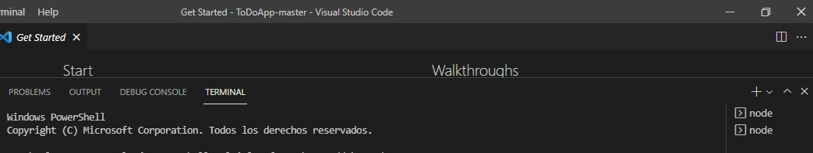
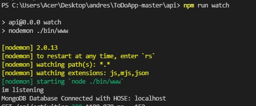
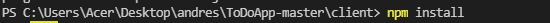
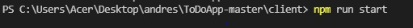

# ToDoApp
ToDoApp using MERN stack
In order to makes this project run you need to follow some steps.
1. you should open two terminals , one to run the backend and one to run the frontend .

2.to run the backend you should use npm run watch in one of the terminal (pointing inside the api folder).
  
3.before running the front end you should type npm install in another terminal (pointing inside the client folder).
  
4.and the to run the front end you should type npm tun start.
 
5.wait for the explorer to open, the apps works better in google chrome. 
 
**APPLICATION EXPLANATION :**
  
6.run add a new activity just type it in the text widget and click in the submit button. 
7.to delete new activity just click in the delete icon of the specific activity you want to delete. 
8.to edit an adcivity you should in the edit button of the acitivity , write in the text widget and click the submit button.
